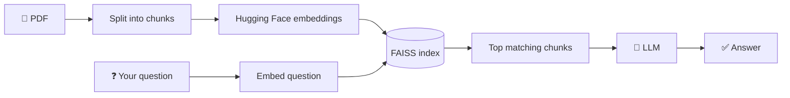
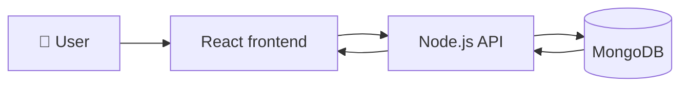
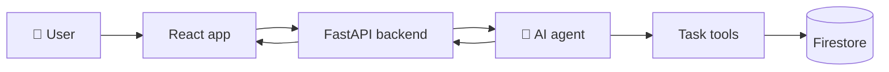
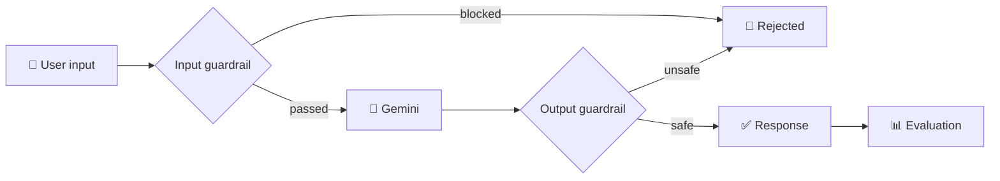

  

<h3 align="center">
  Computer Engineering Student • AI/ML Enthusiast • Future AI Engineer
</h3>

  <a href="#-about-me"><b>👋 About</b></a> &nbsp;•&nbsp;
  <a href="#-tech-stack"><b>🧰 Tech</b></a> &nbsp;•&nbsp;
  <a href="#-my-learning-path"><b>🧠 Learning</b></a> &nbsp;•&nbsp;
  <a href="#-featured-projects"><b>🚀 Projects</b></a> &nbsp;•&nbsp;
  <a href="#-connect-with-me"><b>🌐 Connect</b></a>

---

## 🧭 Pick Your Path

Not sure where to look? Choose what fits you and expand it.

<b>👀 I'm a recruiter / hiring manager</b>

 

* 🚀 Start with **[AskMyPdf](#-featured-projects)** (RAG + FAISS) and **TaskMate** (agentic AI)
* 🧰 Check the **[Tech Stack](#-tech-stack)** for the languages and tools I use
* 🌐 Reach me on **[LinkedIn](https://www.linkedin.com/in/aditi-dhum-a167572ab)**

<b>🤝 I want to collaborate</b>

 

* 🧪 **AI-Frontend-Lab** and **AI-Security-Lab** are open experiment spaces
* 💬 Good topics to talk about: RAG apps, agentic AI, AI security and guardrails, full-stack with React + FastAPI
* 🌐 Message me on **[LinkedIn](https://www.linkedin.com/in/aditi-dhum-a167572ab)**

<b>📚 I'm learning AI too</b>

 

* 🧠 See **[My Learning Path](#-my-learning-path)** below for the order I'm following
* 🧪 The lab repos are full of small experiments you can read and reuse
* ⭐ Follow along on **[GitHub](https://github.com/aditidhum-hub)**

---

## 👋 About Me

🎓 **Computer Engineering Student** passionate about Artificial Intelligence, Machine Learning, and Software Development.

I enjoy turning ideas into practical applications and continuously improving my skills by building projects.

<b>🔎 What I'm into</b>

 

* 🤖 Exploring **AI, Machine Learning & Generative AI**
* 🐍 Building projects with **Python**
* 📊 Learning **Data Science & Deep Learning**
* 🧠 Exploring **LLMs, RAG & Agentic AI**
* 🌐 Interested in **Full-Stack Development**
* 🚀 Building projects that solve **real-world problems**
* 📚 Always learning and experimenting with new technologies

<b>🎯 What I'm working on right now</b>

 

| Status | Project |
| :----: | ------- |
| 🚧 In testing | **TaskMate**: agentic AI task assistant |
| 🧪 Ongoing | **AI-Frontend-Lab**: daily small experiments |
| 🧪 Ongoing | **AI-Security-Lab**: guardrails & evaluation |

---

## 🧰 Tech Stack

<b>💻 Programming</b>

 

  

<b>🤖 AI / ML / Data Science</b>

 

  

`NumPy` • `Pandas` • `Matplotlib` • `Scikit-Learn` • `TensorFlow` • `Keras` • `PyTorch` • `OpenCV`

<b>🌐 Development & Databases</b>

 

  

<b>🛠️ Tools</b>

 

  

---

## 🧠 My Learning Path

This diagram is drawn by GitHub itself, so there are no images to break.

```mermaid
flowchart LR
    A[Artificial Intelligence] --> B[Machine Learning]
    B --> C[Deep Learning]
    C --> D[LLMs & Generative AI]
    D --> E[RAG Systems]
    E --> F[Agentic AI]
    F --> G[AI-Powered Applications]

    style A fill:#4F8EF7,color:#fff,stroke:none
    style B fill:#4F8EF7,color:#fff,stroke:none
    style C fill:#4F8EF7,color:#fff,stroke:none
    style D fill:#7C5CFA,color:#fff,stroke:none
    style E fill:#7C5CFA,color:#fff,stroke:none
    style F fill:#7C5CFA,color:#fff,stroke:none
    style G fill:#22C55E,color:#fff,stroke:none
```

I'm especially interested in building AI systems that combine **LLMs + RAG + Agents + traditional ML**.

<b>✅ Progress checklist</b>

 

Edit these boxes as you go. Change `[ ]` to `[x]` when done.

- [x] Python
- [x] Machine Learning basics
- [ ] Deep Learning
- [ ] LLMs & Generative AI
- [ ] RAG Systems
- [ ] Agentic AI

---

## 🚀 Featured Projects

Click a badge to open the repo, then expand a project to see how it works.

<!-- NOTE: make sure each repo name in the links below matches your real repo name exactly -->

| Project | What it does | Status | Link |
| ------- | ------------ | :----: | :--: |
| 📄 **AskMyPdf** | Ask questions about your PDFs using RAG | ✅ Done |  |
| 💊 **GenericMD** | Browse and buy affordable generic medicines | ✅ Done |  |
| 🤖 **TaskMate** | Agentic AI task management assistant | 🚧 Testing |  |
| 🎨 **AI-Frontend-Lab** | Daily AI + frontend experiments | 🧪 Ongoing |  |
| 🛡️ **AI-Security-Lab** | Chatbot security & guardrails | 🧪 Ongoing |  |

📄 <b>AskMyPdf</b>: how it works

 

AI-powered PDF question answering using **RAG**, Hugging Face embeddings, **FAISS**, and an LLM.

`JavaScript` `RAG` `FAISS` `Hugging Face`

💊 <b>GenericMD</b>: how it works

 

Web-based platform for browsing and purchasing affordable generic medicines, with product search and categories.

`TypeScript` `React` `Node.js` `MongoDB`

🤖 <b>TaskMate</b> 🚧: how it works

 

AI-powered task management assistant built with **Agentic AI** to help users organize and manage tasks.

`TypeScript` `React` `FastAPI` `Firebase` `Firestore` `Agentic AI`

🚧 Currently in the **Testing Phase**.

🎨 <b>AI-Frontend-Lab</b> 🧪: what's inside

 

Daily experimentation lab for small AI, frontend, API, JavaScript, and UI experiments, so ideas and useful code can be built and tested quickly.

`React` `TypeScript` `JavaScript` `Tailwind CSS` `AI` `APIs`

🛡️ <b>AI-Security-Lab</b> 🧪: how it works

 

Hands-on AI security lab exploring chatbot security, API integration, hallucination testing, response evaluation, and input/output guardrails.

`Python` `FastAPI` `Gemini` `AI Evaluation` `Guardrails`

---

## 🔥 GitHub Streak

  

---

## ❓ Quick Q&A

<b>What kind of AI systems do you want to build?</b>

 

Systems that combine **LLMs + RAG + Agents + traditional ML** into real applications.

<b>Where should I start if I want to see your work?</b>

 

**AskMyPdf** for RAG, **TaskMate** for agentic AI, and the two labs for smaller experiments.

<b>What's your motto?</b>

 

💡 **Learn • Build • Experiment • Improve**

---

## 🌐 Connect With Me

---

  <b>💡 Learn • Build • Experiment • Improve</b>

  ⭐ Thanks for visiting my profile! 
  <a href="#">⬆️ Back to top</a>

